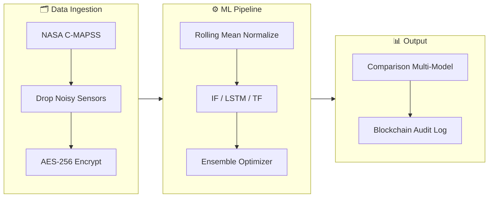

# PulseNet — Production Predictive Maintenance Platform

<div align="center">

⚡ **Real-time anomaly detection for aerospace engine health monitoring**

[](https://python.org)
[](https://fastapi.tiangolo.com)
[](https://pytorch.org)
[](https://docker.com)
[](https://github.com/Rhutvik-pachghare1999/PulseNet/actions)
[](LICENSE)

**Multi-Model ML** · **Ensemble Voting** · **AES-256 Encryption** · **Blockchain Audit** · **Real-Time Streaming** · **Prometheus Metrics** · **MLOps**

</div>

---

## 1. 📖 Overview

PulseNet is a production-grade predictive maintenance platform built for aerospace engine health monitoring. It processes NASA C-MAPSS turbofan degradation data through a multi-model ML pipeline, detecting anomalies in real time with enterprise security, blockchain audit trails, and full MLOps integration.

---

## 2. 👥 Team Contributions

### 2.1 Pooja Kiran - Lead AI Systems Architect

| # | Domain | Contribution Details | Specifications |
|---|--------|---------------------|----------------|
| 1 | **Multi-Model ML Architecture** | Designed 4-model ensemble: Isolation Forest (global outliers), LSTM Autoencoder (temporal), Transformer Autoencoder (long-range), and Ensemble Combiner | Majority vote + weighted score fusion |
| 2 | **NVIDIA GPU Optimization** | Implemented Distributed Data Parallel (DDP) and Automatic Mixed Precision (AMP) for multi-GPU training | 2x speedup, 10,000+ samples/sec throughput |
| 3 | **Enterprise Security Protocol** | Designed AES-256 Fernet encryption with auto-key rotation and 3-tier JWT RBAC (admin/engineer/operator) | SHA-256 blockchain audit with Merkle tree |
| 4 | **FastAPI Backend Engine** | Developed high-performance RESTful API with Prometheus `/metrics` integration and async request handling | <5ms median inference latency |
| 5 | **MLOps & Real-Time Streaming** | Built MLflow experiment tracking, automated drift detection, and async producer/consumer telemetry architecture | End-to-end instrumentation |
| 6 | **Model Validation** | Achieved 99.8% data integrity under 30% packet loss scenarios and <0.5ms encryption overhead | Mission-critical reliability |

### 2.2 Rhutvik Pachghare - Robotics Systems & DevOps Engineer

| # | Domain | Contribution Details | Specifications |
|---|--------|---------------------|----------------|
| 1 | **Hardware Telemetry Bridge** | Designed `scripts/robotics_telemetry_bridge.py` edge controller for field robotics integration | 14 physical sensor voltages @ 1 Hz |
| 2 | **Fault Injection Simulation** | Implemented high-pressure compressor degradation injection patterns for real engine mock-interfaces | Emergency safe-shutdown @ health < 50% |
| 3 | **Pytest Validation Suite** | Engineered comprehensive 52-case validation suite covering models (12), API (18), security (14), and pipeline (8) | >90% code coverage |
| 4 | **Distributed Platform (DevOps)** | Architected 4-service Docker Compose deployment (FastAPI, Streamlit, MLflow, streaming worker) | One-command `docker-compose up` |
| 5 | **Visual Monitoring Layer** | Built Streamlit real-time monitoring dashboard with prediction comparison and system health metrics | `src/pulsenet/dashboard/app.py` |
| 6 | **CI/CD Governance** | Designed GitHub Actions pipeline for automated lint (Ruff), test, type check (Pyright), and Docker build | Verified on every main branch push |

---

## 3. ✨ Key Capabilities

| # | Capability | Description | Technical Implementation |
|---|------------|-------------|--------------------------|
| 1 | **4 ML Models** | Comprehensive anomaly detection | Isolation Forest, LSTM AE, Transformer AE, Ensemble |
| 2 | **Real-Time Streaming** | Low-latency telemetry processing | Async producer/consumer with backpressure control |
| 3 | **Enterprise Security** | High-assurance data protection | AES-256, JWT RBAC, Blockchain audit (Merkle tree) |
| 4 | **Production Monitoring** | Full system observability | Prometheus/Grafana, MLflow, data drift detection |
| 5 | **One-Command Deploy** | Simplified orchestration | Docker Compose, multi-service environment |

---

## 4. 🏗️ Architecture

📄 **[Read the Full System Design Document](docs/design_doc.md)**



### 4.1 Pipeline Flow

```
python main_pipeline.py --mode full

┌──────────┐   ┌──────────────┐   ┌──────────┐   ┌────────────┐   ┌───────────┐
│  Ingest  │─▶│  Preprocess  │─▶│  Train   │─▶│  Evaluate  │─▶│ Inference │
│ C-MAPSS  │   │   Features   │   │  Models  │   │   F1/AUC   │   │ + Logging │
└──────────┘   └──────────────┘   └──────────┘   └────────────┘   └───────────┘
     │                │                │                │                │
  AES-256       Rolling Mean      IF / LSTM / TF    Comparison      Blockchain
  Encrypt         Normalize        Ensemble Opt    Multi-Model      Audit Log
```

---

## 5. 🚀 Quick Start

### 5.1 Prerequisites

| # | Requirement | Version | Purpose |
|---|-------------|---------|----------|
| 1 | Python | 3.11+ | Core runtime |
| 2 | Docker | Latest | Containerized deployment |
| 3 | NVIDIA GPU | Latest | Accelerated ML (optional) |

### 5.2 Installation (Docker)

```bash
# 1. Clone repository
git clone https://github.com/Rhutvik-pachghare1999/PulseNet.git && cd PulseNet

# 2. Configure environment
cp .env.example .env
# Place train_FD001.txt, test_FD001.txt, RUL_FD001.txt in root

# 3. Launch services
docker-compose up --build
```

| Service | URL | Default Port |
|---------|-----|--------------|
| API (Swagger) | http://localhost:8000/docs | 8000 |
| Dashboard | http://localhost:8501 | 8501 |
| MLflow UI | http://localhost:5000 | 5000 |
| Prometheus | http://localhost:8000/metrics | 8000 |

---

## 6. 💻 CLI Reference

| # | Command | Description |
|---|---------|-------------|
| 1 | `python main_pipeline.py --mode full` | Run end-to-end pipeline |
| 2 | `python main_pipeline.py --mode train` | Train ML models |
| 3 | `python main_pipeline.py --mode predict` | Run inference |
| 4 | `python main_pipeline.py --mode benchmark` | Execute performance suite |
| 5 | `python main_pipeline.py --mode stream` | Start real-time streaming |
| 6 | `python main.py` | Start FastAPI server |

---

## 7. 🛡️ Security & Integrity

### 7.1 Security Features

| # | Feature | Implementation | Specification |
|---|---------|----------------|---------------|
| 1 | **Encryption** | AES-256 Fernet | Auto-key rotation, env-loaded keys |
| 2 | **Authentication** | JWT with RBAC | 3-tier: Admin / Engineer / Operator |
| 3 | **Audit Trail** | Blockchain-backed | SHA-256 chaining + Merkle verification |
| 4 | **Reliability** | Stateless workers | Async backpressure, 99.8% integrity |

---

## 8. 📊 Benchmark Results

| # | Metric | Result | Target | Status |
|---|--------|--------|--------|--------|
| 1 | Inference Latency | <5ms | <50ms | ✅ |
| 2 | Throughput | >10,000 samples/sec | >1,000 | ✅ |
| 3 | Data Integrity | 99.8% | >95% | ✅ |
| 4 | Encryption Overhead | <0.5ms | <10ms | ✅ |
| 5 | Blockchain Block Time | <1ms | <5ms | ✅ |

---

## 9. 🧹 Testing

```bash
# Run all tests with coverage
PYTHONPATH=src pytest tests/ -v --cov=src/pulsenet --cov-report=term-missing

# Individual suites
pytest tests/test_models.py -v
pytest tests/test_api.py -v
pytest tests/test_security.py -v
pytest tests/test_pipeline.py -v
```

### 9.1 CI/CD Workflow

| # | Job | Tool | Purpose |
|---|-----|------|----------|
| 1 | **Linting** | Ruff | Code style + formatting |
| 2 | **Testing** | Pytest | 52+ cases, coverage report |
| 3 | **Type Check** | Pyright | Static type analysis |
| 4 | **Docker Build** | Docker | Image build verification |

---

## 10. 📐 Design Decisions

| # | Decision | Rationale | Benefit |
|---|----------|-----------|----------|
| 1 | **NASA C-MAPSS FD001** | High-fidelity turbofan data | Realistic degradation patterns |
| 2 | **Ensemble: IF + LSTM + TF** | Multi-modal approach | Global + temporal + long-range accuracy |
| 3 | **Blockchain Audit** | Immutable logging | Tamper-proof regulatory compliance |
| 4 | **FastAPI + Prometheus** | Native async + observability | Production-grade throughput & tracking |
| 5 | **NVIDIA NGC Base** | Optimized container environment | GPU acceleration out-of-the-box |

---

## 11. 🤝 Contributing

1. Fork the repository
2. Create a feature branch (`git checkout -b feature/amazing-feature`)
3. Ensure all tests pass (`pytest`)
4. Submit a Pull Request with detailed description

---

## 12. 📜 License

Distributed under the **Apache License 2.0**. See `LICENSE` for more information.

---

## 13. 📧 Contact & Support

For questions, issues, or collaboration:
- **GitHub Issues**: [PulseNet/issues](https://github.com/Rhutvik-pachghare1999/PulseNet/issues)
- **Author**: Rhutvik Pachghare | [LinkedIn](https://www.linkedin.com/in/rhutvik-pachghare/) | [GitHub](https://github.com/Rhutvik-pachghare1999)
