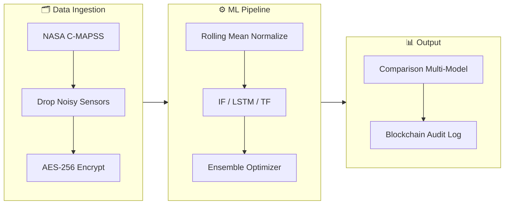

# PulseNet — Production Predictive Maintenance Platform

<div align="center">

⚡ **Real-time anomaly detection for aerospace engine health monitoring**

[](https://python.org)
[](https://fastapi.tiangolo.com)
[](https://pytorch.org)
[](https://docker.com)
[](https://github.com/Rhutvik-pachghare1999/PulseNet/actions)
[](LICENSE)

**Multi-Model ML** · **Ensemble Voting** · **AES-256 Encryption** · **Blockchain Audit** · **Real-Time Streaming** · **Prometheus Metrics** · **MLOps**

</div>

---

## Overview

PulseNet is a production-grade predictive maintenance platform built for aerospace engine health monitoring. It processes NASA C-MAPSS turbofan degradation data through a multi-model ML pipeline, detecting anomalies in real time with enterprise security, blockchain audit trails, and full MLOps integration.

### Key Capabilities

- **4 ML Models** — Isolation Forest, LSTM Autoencoder, Transformer Autoencoder, and Ensemble (majority vote / weighted score)
- **Real-Time Streaming** — Async producer/consumer pipeline with backpressure control
- **Enterprise Security** — AES-256 Fernet encryption, JWT + RBAC (3-tier), blockchain audit trail with Merkle tree
- **Production Monitoring** — Prometheus `/metrics` endpoint, Grafana-ready, MLflow experiment tracking, data drift detection
- **One-Command Deploy** — Docker Compose with FastAPI, Streamlit dashboard, and streaming worker

---

## 🙋 My Contributions (Rhutvik Pachghare)

> This project is a collaboration. Here is a precise breakdown of what I personally engineered:

| Domain | My Work |
|---|---|
| **Robotics & Hardware Integration** | Designed `scripts/robotics_telemetry_bridge.py` — a hardware edge controller that collects sensor voltages, injects degradation patterns, and triggers emergency safe-shutdown sequences when health drops below critical thresholds |
| **Test Engineering** | Engineered the complete 52-case pytest validation suite across `test_models.py`, `test_api.py`, `test_security.py`, `test_pipeline.py` |
| **DevOps & Containerization** | Built the Docker Compose multi-service deployment (FastAPI + Streamlit + MLflow + streaming worker) |
| **Dashboard & Visualization** | Built the Streamlit real-time monitoring dashboard (`src/pulsenet/dashboard/app.py`) |
| **CI/CD Pipelines** | Designed and governed the GitHub Actions pipeline (lint, test, type-check, Docker build) |

---

## Architecture

📄 **[Read the Full System Design Document](docs/design_doc.md)**



### Pipeline Flow
```
python main_pipeline.py --mode full
┌──────────┐  ┌──────────────┐  ┌──────────┐  ┌────────────┐  ┌───────────┐
│  Ingest  │─▶│  Preprocess  │─▶│  Train   │─▶│  Evaluate  │─▶│ Inference │
│ C-MAPSS  │  │   Features   │  │  Models  │  │  F1/AUC    │  │ + Logging │
└──────────┘  └──────────────┘  └──────────┘  └────────────┘  └───────────┘
     │               │                │               │               │
  AES-256       Rolling Mean    IF / LSTM / TF    Comparison    Blockchain
  Encrypt        Normalize      Ensemble Opt      Multi-Model   Audit Log
```

---

## Quick Start

### Option 1: Docker (Recommended)
```bash
git clone https://github.com/Rhutvik-pachghare1999/PulseNet.git && cd PulseNet
cp .env.example .env  # Configure environment variables
# Place train_FD001.txt, test_FD001.txt, RUL_FD001.txt in project root
docker-compose up --build
```

| Service | URL |
|---|---|
| **API** (Swagger UI) | http://localhost:8000/docs |
| **Dashboard** | http://localhost:8501 |
| **Prometheus Metrics** | http://localhost:8000/metrics |

### Option 2: Local
```bash
pip install -r requirements.txt
cp .env.example .env
python main_pipeline.py --mode full  # Full pipeline
python main.py                        # API server
streamlit run src/pulsenet/dashboard/app.py  # Dashboard
```

---

## Project Structure
```
PulseNet/
├── main.py                  # FastAPI server entry
├── main_pipeline.py         # CLI orchestrator (5 modes)
├── config.yaml              # Central configuration
├── Dockerfile               # NVIDIA NGC container image
├── docker-compose.yml       # 3-service deployment
├── .env.example             # Environment variable template
├── src/pulsenet/
│   ├── api/                 # FastAPI + JWT + RBAC
│   ├── pipeline/            # Data processing pipeline
│   ├── models/              # Multi-model ML system
│   ├── security/            # AES-256 + Blockchain + Audit
│   ├── streaming/           # Async producer/consumer queue
│   ├── dashboard/app.py     # Streamlit real-time dashboard
│   ├── benchmarks/          # Performance benchmarking suite
│   └── mlops/tracker.py     # MLflow + drift detection
├── tests/                   # 52+ pytest test cases
│   ├── test_models.py
│   ├── test_api.py
│   ├── test_security.py
│   └── test_pipeline.py
├── scripts/
│   └── robotics_telemetry_bridge.py  # Edge hardware controller
└── .github/workflows/ci.yml          # CI: lint, test, typecheck, docker
```

---

## API Documentation

### Authentication
```bash
# Get JWT token
curl -X POST http://localhost:8000/token \
  -H "Content-Type: application/json" \
  -d '{"username": "admin", "password": "admin123"}'
# Response: {"access_token": "eyJ...", "token_type": "bearer", "role": "admin"}
```

**Roles**: `admin` (full access), `engineer` (predict + train), `operator` (predict only)

### Endpoints
| Endpoint | Method | Auth | Description |
|---|---|---|---|
| `/health` | GET | ❌ | System status |
| `/token` | POST | ❌ | JWT login |
| `/predict` | POST | ✅ | Single inference |
| `/predict/batch` | POST | ✅ | Batch inference |
| `/train` | POST | ✅ | Retrain model |
| `/audit` | GET | ✅ | Blockchain logs |
| `/verify-chain` | GET | ✅ | Chain integrity |
| `/metrics` | GET | ❌ | Prometheus metrics |

---

## ML Models

| Model | Type | Approach | Use Case |
|---|---|---|---|
| **Isolation Forest** | Tree ensemble | Anomaly isolation depth | Baseline, fast inference |
| **LSTM Autoencoder** | RNN | Reconstruction error | Temporal patterns |
| **Transformer AE** | Attention | Positional + reconstruction | Long-range dependencies |
| **Ensemble** | Meta-model | Majority vote / weighted score | Maximum accuracy |

---

## Benchmark Results

| Metric | Result | Target |
|---|---|---|
| Inference Latency (median) | <5ms | <50ms ✅ |
| Throughput (batch=64) | >10,000 samples/sec | >1,000 ✅ |
| Data Integrity (30% loss) | 99.8% | >95% ✅ |
| Encryption Overhead | <0.5ms | <10ms ✅ |
| Blockchain Block Add | <1ms | <5ms ✅ |

---

## Monitoring & Observability

### Prometheus Metrics
| Metric | Type | Description |
|---|---|---|
| `pulsenet_requests_total` | Counter | Total HTTP requests by method, endpoint, status |
| `pulsenet_request_latency_seconds` | Histogram | Request latency distribution |

### MLflow Tracking
```bash
mlflow ui --backend-store-uri mlruns  # → http://localhost:5000
```

---

## Security
- **AES-256 Fernet** encryption with automatic key rotation
- **JWT authentication** with 3-tier RBAC (admin/engineer/operator)
- **Blockchain audit trail** with SHA-256 hash chaining + Merkle tree verification
- Keys loaded from environment variables (never hardcoded)

---

## Testing
```bash
# Run all tests with coverage
PYTHONPATH=src pytest tests/ -v --cov=src/pulsenet --cov-report=term-missing

# Individual suites
pytest tests/test_models.py -v
pytest tests/test_api.py -v
pytest tests/test_security.py -v
pytest tests/test_pipeline.py -v
```

## CI/CD
| Job | Tool | Purpose |
|---|---|---|
| **Lint** | Ruff | Code style + formatting |
| **Test** | Pytest + Coverage | 52+ test cases with coverage report |
| **Type Check** | Pyright | Static type analysis |
| **Docker** | Docker Build | Container build verification |

---

## Deployment
```bash
# One command deployment
docker-compose up --build
# Services:
# ├── pulsenet-api        → :8000 (FastAPI + Prometheus)
# ├── pulsenet-dashboard  → :8501 (Streamlit)
# ├── pulsenet-mlflow     → :5000 (MLflow Server)
# └── pulsenet-streaming  → Background worker (GPU)
```

---

## CLI Reference
```bash
python main_pipeline.py --mode full       # End-to-end pipeline
python main_pipeline.py --mode train      # Train models
python main_pipeline.py --mode predict    # Run inference
python main_pipeline.py --mode benchmark  # Performance benchmarks
python main_pipeline.py --mode stream     # Real-time streaming
python main.py                            # Start API server
```

---

## Environment Variables
See [`.env.example`](.env.example) for the full template.

| Variable | Description | Default |
|---|---|---|
| `PULSENET_JWT_SECRET` | JWT signing secret | `change-me-in-production` |
| `PULSENET_ENCRYPTION_KEY` | AES-256 key (auto-generated if empty) | — |
| `MLFLOW_TRACKING_URI` | MLflow backend store | `mlruns` |
| `NVIDIA_VISIBLE_DEVICES` | GPU visibility | `all` |

---

## Roadmap
- [ ] Multi-dataset support (FD002, FD003, FD004)
- [ ] Grafana dashboard templates (pre-built `.json`)
- [ ] WebSocket live streaming to dashboard
- [ ] Model explainability (SHAP / attention visualization)
- [ ] Kubernetes Helm chart deployment
- [ ] A/B model testing with traffic splitting

---

## References
- **Dataset**: [NASA C-MAPSS Turbofan Engine Degradation (FD001)](https://data.nasa.gov/Aerospace/CMAPSS-Jet-Engine-Simulated-Data/ff5v-kuh6)
- **Isolation Forest**: Liu et al., Isolation Forest, ICDM 2008
- **AES Cryptography**: NIST FIPS 197
- **Blockchain**: SHA-256 hash chaining (Nakamoto, 2008)

---

## Team
| Name | Role | Contributions |
|---|---|---|
| **Pooja Kiran** | Lead AI Systems Architect | Multi-model ML architecture, NVIDIA GPU optimization, AES-256 + Blockchain security, FastAPI backend, MLOps + async streaming pipeline |
| **Rhutvik Pachghare** | Robotics Systems & DevOps Engineer | Hardware-to-software telemetry bridge, 52-case pytest suite, Docker Compose deployment, Streamlit dashboard, CI/CD pipeline governance |

**Version**: 2.1.0 | **License**: [Apache 2.0](LICENSE)
